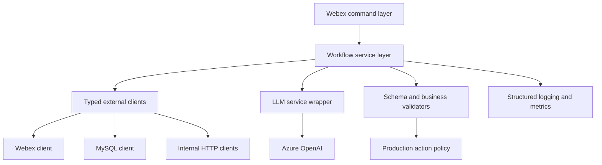

# LeRAI Code Quality and Reliability Review

This document reviews major flaws, reliability risks, best-practice gaps, and improvement opportunities in the current LeRAI codebase. It is intentionally separate from `docs/PROJECT_FLOW.md` so a new maintainer can first understand how the system works, then use this document to plan hardening work.

This review describes the current code after the recent static cleanup. It also calls out issues that were already fixed so future maintainers understand why some code changed.

## Executive Summary

LeRAI is a useful operational assistant, but the current implementation is still fragile for production use. The largest reliability risks come from four areas:

1. LLM outputs are treated as dependable structured data in places where deterministic parsing or schema validation should be used.
2. Several workflows depend on external services without retries, request correlation, or centralized error handling.
3. Some modules still use mutable global or process-local state, which can behave unpredictably under concurrent or restarted bot usage.
4. Configuration, logging, imports, and validation are scattered across modules instead of centralized.

Recent cleanup fixed several obvious runtime problems, hardened the shared Azure OpenAI client, signed promotion approval tokens, replaced `/promote` LLM extraction with deterministic parsing, and removed the DP global state. The next work should prioritize config validation, structured logging, request correlation, output validation, and retry/error handling.

Current local validation snapshot (2026-07-03):

- `python3 -m unittest tests.test_openai_agent_client tests.test_query_response_parsing tests.test_promote_security tests.test_dp_ama_state tests.test_config tests.test_logging_utils` passes with 44 tests.
- `python3 -m compileall .` completes without syntax errors.

## Already Improved in Recent Cleanup

These items were improved before this document was written:

| Area | Files | Current state |
| --- | --- | --- |
| Missing imports | `lerai/promote.py`, `lerai/query2_variance_addition.py`, `lerai/quota_exceed.py` | Missing imports for modules such as `os`, `json`, `time`, `base64`, and `urllib.parse` were added. |
| Duplicate imports | `lerai/log_error_summary.py`, Query2 modules | Some duplicate/unused imports were removed. |
| Azure OpenAI client | `openai_agent/openai_agent_client.py` | Global `requests.post` monkey patch was removed; payload construction is local; model/generation kwargs are honored; timeout and TLS verification controls were added. |
| Dependency tracking | `requirements.txt` | A minimal dependency file now lists runtime packages. |
| No-server tests | `tests/` | Unit tests now cover LLM payload construction and Query2 response parsing. |
| Compile validation | repository-wide | `python3 -m compileall .` passed after cleanup. |
| Promotion token security | `lerai/promote.py`, `tests/test_promote_security.py` | Approval tokens are now HMAC-signed, versioned, and TTL-validated with `PROMOTION_TOKEN_SECRET` and `PROMOTION_TOKEN_TTL_SECONDS`. |
| Promotion parsing | `lerai/promote.py`, `tests/test_promote_security.py` | `/promote` now uses deterministic parser patterns instead of LLM extraction. |
| DP request state | `lerai/DP_AMA.py`, `lerai/lerai_commands.py`, `tests/test_dp_ama_state.py` | `dplist_save` was removed; DP candidate and verification paths can share explicit request-scoped DP data. |
| Config helper foundation | `lerai/config.py`, `tests/test_config.py` | Shared helpers now exist for required, optional, integer, boolean, JSON, and file-based environment settings. |
| Query2 parser hardening | `lerai/query2_variance_addition.py`, `lerai/quota_exceed.py`, `tests/test_query_response_parsing.py` | Malformed JSON, non-object responses, bad row shapes, corrected quota headers, and non-numeric quota values are now handled with explicit error messages. |

These changes reduce obvious startup/runtime failures, but they do not remove the higher-level reliability risks below.

## Critical and High-Risk Issues

### 1. Production Promotion Flow Still Needs Full Operational Controls

Location: `lerai/promote.py`

The approval token implementation has been improved. Tokens now use this format:

```text
v2.<base64url-json-payload>.<base64url-hmac-signature>
```

Completed improvements:

- Tokens are HMAC-SHA256 signed using `PROMOTION_TOKEN_SECRET`.
- Tokens expire according to `PROMOTION_TOKEN_TTL_SECONDS`, defaulting to 3600 seconds.
- Tampered, expired, malformed, and unsigned tokens are rejected by tests.
- Active high-risk `print()` calls were replaced with logger calls and shared redaction helpers.

Remaining risks:

- The promotion call to `LEROY_AGENT_PROMOTE_URL` still needs request correlation, audit logging, and idempotency protection if the upstream service supports it.
- `PROMOTION_TOKEN_SECRET` must be configured securely in deployment; missing secret prevents token creation and approval verification.
- Rollout should account for old unsigned tokens being intentionally invalid after this change.

Recommended next controls:

- Add audit logs containing request id, requester, approver, source space, and LeROY result.
- Add an idempotency key to the LeROY call if supported.
- Decide the production TTL policy and document it for operators.

### 2. LLM-Based Parsing Is Used Where Deterministic Parsing Is Safer

Locations:

- `lerai/DP_AMA.py`
- `lerai/leroy_overrides_writer.py`
- `lerai/FD_AMA.py`

Examples:

- `/promote` previously asked the LLM to identify the approver and promotion token from free-form text. This has been fixed; it now uses deterministic parser patterns.
- `LRDPDevCommand` still extracts `<answer>` and `<verdict>` tags from LLM output using regex.
- `leroy_overrides_writer.py` returns model-generated TOML without validating the generated content against a TOML parser and schema.
- `FD_AMA.py` trusts model-generated tool arguments after `json.loads()`.

Why this can cause unreliable or random behavior:

- Even at low temperature, LLM output can vary in formatting.
- Prompts can be affected by user phrasing and prompt injection.
- Missing tags, malformed JSON, or extra Markdown can break parsing.
- Production actions should continue to avoid model-dependent parsing.

Recommended fix:

- Keep deterministic command grammar for production actions, such as:

```text
/promote approver=<name> token=<token>
```

- Use structured output schemas for LLM tasks that truly need model extraction.
- Validate all parsed LLM output with explicit schemas before use.
- For TOML output, parse TOML and validate against a maintained schema before returning it.

### 3. Remaining Global or Process-Local State Can Cross-Contaminate Requests

Locations:

- `lerai/leroy_overrides_writer.py`: `webex_thread_chatgpt_history`

Problems:

- `DP_AMA.py` previously stored the latest DP query result in `dplist_save`. That global has been removed.
- `webex_thread_chatgpt_history` is a module-level dict without explicit eviction, ownership, or persistence semantics.

Why this can cause unreliable or random behavior:

- User-specific context can leak across requests if thread/session identifiers are not handled carefully.
- In-memory state disappears on process restart.

Recommended fix:

- For multi-turn state, use a session object keyed by Webex room/thread/user with TTL and size limits.
- Add tests for override-writer session isolation if multi-turn behavior is kept.

### 4. External Service Calls Have Little Resilience

Locations:

- `lerai/csv_env_diff.py`
- `lerai/log_error_summary.py`
- `lerai/expected_observed_comparison.py`
- `lerai/FD_AMA.py`
- `lerai/query2_variance_addition.py`
- `lerai/quota_exceed.py`
- `lerai/promote.py`
- `lerai/mysql_client.py`

Problems:

- HTTP calls generally do not use retries or exponential backoff.
- Service errors are converted directly into user-visible strings in many command handlers.
- There is no centralized distinction between transient, permanent, auth, validation, and data-contract failures.
- MySQL queries open a new connection for every call and have no retry around transient connection failures.

Why this can cause unreliable or random behavior:

- A temporary network blip appears to users as a bot failure.
- Rate limits or occasional 5xx responses are not retried.
- Operators cannot easily tell whether an issue is user input, config, upstream service, or LLM failure.

Recommended fix:

- Introduce retry wrappers for idempotent reads using bounded exponential backoff.
- Do not retry production side effects unless the action is idempotent or protected by an idempotency key.
- Add typed exception classes such as `ConfigError`, `UpstreamServiceError`, `LLMOutputError`, and `ValidationError`.
- Return user-friendly messages while logging detailed structured errors.

### 5. Configuration Validation Is Scattered

Locations:

- `openai_agent/openai_agent_client.py`
- `lerai/mysql_client.py`
- `lerai/lerai_main.py`
- `lerai/scheduled_jobs.py`
- `lerai/FD_AMA.py`
- `lerai/csv_env_diff.py`
- `lerai/log_error_summary.py`
- `lerai/expected_observed_comparison.py`
- `lerai/query2_variance_addition.py`
- `lerai/quota_exceed.py`
- `lerai/promote.py`

Problems:

- Environment variables are read directly from many modules.
- Some modules fail early; others use default placeholder values such as `default_value`.
- Certificate paths and service URLs are still duplicated across files, although `lerai/config.py` now provides helpers that can be adopted incrementally.
- Missing config often fails only when a command is first used.

Why this can cause unreliable or random behavior:

- Bot startup can succeed even though some commands are impossible to run.
- Missing environment variables produce late, command-specific failures.
- Operators may not know which workflow is misconfigured until a user tries it.

Recommended fix:

- Continue wiring modules to `lerai/config.py` helpers.
- Validate required settings at startup for enabled features.
- Allow optional workflows to be disabled explicitly when their config is missing.
- Add a startup config report that does not print secret values.

### 6. Debug Prints and Logging Are Not Production-Grade

Status: partially addressed. Most active `print()` calls were replaced with logger calls in the no-server logging pass, and `lerai/logging_utils.py` now redacts common secrets and PII. A small number of manual CLI `print()` calls still exist in `lerai/leroy_overrides_writer.py`. Request correlation ids and production log field design remain open.

Locations include:

- `lerai/FD_AMA.py`
- `lerai/promote.py`
- `lerai/leroy_overrides_writer.py`
- `lerai/scheduled_jobs.py`
- `lerai/lerai_commands.py`
- `lerai/lerai_main.py`

Problems:

- Debug information now uses logger calls, but logging handlers and production field conventions are not centrally defined.
- Full prompts, messages, stdout/stderr, and token-like values now pass through basic redaction helpers before logging.
- Logs lack correlation ids and structured fields.
- Command entry logging uses a shared helper, but the command classes still call it individually.

Why this can cause unreliable or random behavior:

- It does not directly change model behavior, but it makes incidents harder to debug.
- Sensitive operational data may leak into logs.
- In multi-user traffic, logs from unrelated commands are difficult to separate.

Recommended fix:

- Continue using module-level loggers and expand tests as more fields become stable.
- Add a request id at command entry and pass it through workflow calls.
- Extend redaction rules as deployment-specific sensitive fields are confirmed.
- Centralize command-entry logging in a shared command base class if command duplication grows.

## Medium-Risk Maintainability Issues

### Package Import Hygiene

The root `lerai_main.py` inserts the `lerai/` directory into `sys.path`. Several modules use bare imports such as `from csv_env_diff import ...` rather than package-relative imports.

Risks:

- Import behavior depends on how the process is launched.
- Tests and tooling may behave differently from the production launcher.
- Future packaging will be harder.

Recommended fix:

- Use consistent package imports inside `lerai/`.
- Remove the `sys.path.insert` workaround after imports are corrected.
- Add import-only tests for key modules.

### Command Classes Repeat Boilerplate

Each command repeats similar `pre_execute()` code to log user email, command, and message.

Risks:

- Logging behavior will drift between commands.
- Adding request ids or redaction requires editing every command.

Recommended fix:

- Add a shared base command or helper for common pre-execute logging.
- Keep workflow-specific messages in each command.

### Prompt and Model Configuration Is Hardcoded

Locations:

- `lerai/DP_AMA.py`
- `lerai/FD_AMA.py`
- `lerai/leroy_overrides_writer.py`
- `openai_agent/openai_agent_client.py`

Problems:

- Some modules hardcode `gpt-4.1`; others use `gpt-5.2`.
- Prompt templates are files, but model choice and validation policy are in code.
- There is no prompt versioning or evaluation record.

Recommended fix:

- Centralize model names in configuration.
- Add prompt version metadata.
- Add regression tests or eval cases for prompt-sensitive workflows.

### Large Inputs Are Sent Directly to the LLM

Locations:

- `lerai/DP_AMA.py`
- `lerai/csv_env_diff.py`
- `lerai/log_error_summary.py`
- `lerai/expected_observed_comparison.py`

Problems:

- Raw DB results, diffs, or logs can be large.
- There is limited chunking, summarization, truncation, or row-count control.
- Token limits and latency can vary based on upstream data volume.

Why this can cause unreliable or random behavior:

- Longer prompts increase latency and cost.
- Truncated upstream responses or model context limits can change output quality.
- A daily report with unusually large logs can fail while normal days work.

Recommended fix:

- Add input size limits and explicit truncation warnings.
- Use chunk-and-merge summaries for logs and diffs.
- Include row counts and omitted-data counts in user-facing summaries.

### API Contract Validation Is Weak

Many modules assume upstream responses have the expected shape:

- Query2 returns JSON with `returncode`, `stdout`, and `stderr`; the variance/quota parsers now validate malformed response shapes more defensively.
- `stdout` is still a Python-list-like string parsed by `ast.literal_eval()`.
- HTTP text endpoints return content suitable for immediate prompt injection.
- Footprint API responses are JSON and tool arguments are valid.

Recommended fix:

- Validate response schema at every external boundary.
- Add tests for malformed and partial responses.
- Prefer JSON from upstream services over Python repr strings when possible.

## Lower-Priority Cleanup Items

| Issue | Location | Why it matters |
| --- | --- | --- |
| Typos in function/variable names | `create_dp_candiate_answer`, `userquetion` | Makes code harder to search and maintain. |
| Legacy function-call path remains | `answer_footprint_question_legacy()` in `FD_AMA.py` | Adds maintenance burden unless still needed. |
| Commented-out code | Several modules | Makes it unclear what is intentionally disabled versus abandoned. |
| Unused imports remain in some modules | Several modules | Adds noise and hides real dependencies. |
| Minimal README | `README.md` | New maintainers need the docs added here and a quickstart link. |

## Sources of Unreliable or Random Behavior

| Source | Where | Why it appears random |
| --- | --- | --- |
| LLM output format variability | DP, FD, promote, override writer | Formatting can change across prompts, models, and backend updates. |
| Flexible command-text parsing for production actions | `/promote` | Ambiguous or malformed messages are now deterministically rejected, but user formatting variance can still cause failed parsing. |
| No schema validation of LLM results | Several LLM workflows | Bad output may be accepted or fail late. |
| External service variability | HTTP endpoints, MySQL, Webex, Azure OpenAI | Network, rate limits, auth, or upstream data changes affect output. |
| Process-local mutable state | override writer | Concurrent or restarted bot sessions can lose or mix conversation state if ownership and TTL are not enforced. |
| Large prompt inputs | logs, diffs, DB results | Token size, latency, and truncation vary by data volume. |
| No retries | most external calls | Transient failures are exposed as command failures. |
| Missing request correlation | all workflows | Failures are hard to trace, making behavior seem inconsistent. |
| Weak config validation | many modules | Some workflows fail only when first used. |

## Security and Production-Action Risks

### Approval Workflow

The approval flow should be treated as high risk because it can trigger promotion behavior through `LEROY_AGENT_PROMOTE_URL`.

Currently implemented controls:

- HMAC-signed approval tokens.
- Token TTL enforcement.
- Explicit requester/approver validation in approval handling.

Recommended controls:

- Audit log containing request id, requester, approver, source space, and action result.
- Idempotency key for promotion calls if the upstream service supports it.
- Clear separation between plan/preview and apply/execute.

### Prompt Injection

User input is concatenated into prompts in several modules. For summarization workflows this may be acceptable with clear output limitations. For production actions or generated configuration, it is risky.

Recommended controls:

- Put untrusted user content in clearly delimited sections.
- Tell the model that user content is data, not instructions.
- Validate outputs with schemas and deterministic checks.
- Avoid letting model output directly trigger production actions.

### Secrets and Logs

Environment variables include API keys, database passwords, Webex tokens, and certificate paths. Debug prints may expose payloads or tokens.

Recommended controls:

- Redact sensitive values in logs.
- Use a secret manager in deployed environments.
- Avoid printing full prompts, raw responses, approval tokens, API keys, or cert paths.
- Rotate secrets on a defined schedule according to team policy.

## Testing Gaps

Current tests cover only a small slice. The most important missing tests are:

| Area | Suggested tests |
| --- | --- |
| Promotion tokens | Tests now cover valid token, expired token, tampered token, and missing secret. Add wrong-approver handler-level tests when Webex activity handling is mocked. |
| Promotion parsing | Tests now cover deterministic parser cases. Add handler-level tests for ambiguous command rejection with guidance. |
| LLM output validation | malformed JSON, Markdown-wrapped JSON, missing fields, extra fields. |
| DP concurrency | simultaneous requests do not share state. |
| Query2 parsing | Basic malformed JSON, row-shape, corrected header, and non-numeric value tests now exist. Add more cases for unexpected headers and upstream contract changes. |
| Config validation | Helper-level tests now exist. Add module-level tests as each workflow adopts the helpers. |
| HTTP retries | transient 500/timeout retries for idempotent reads. |
| Footprint tool calls | invalid tool names, invalid arguments, API failure returned to model safely. |
| Large input handling | logs/diffs/DB outputs above configured limits. |

## Prioritized Remediation Roadmap

### Phase 1: No-Server Safety Improvements

These can be implemented and tested without a live Webex bot:

1. Wire existing modules to the new config helpers for required env vars and cert/key paths.
2. Add request correlation ids at command entry.
3. Add TOML parsing and schema validation for override writer output.
4. Add unit tests for handler-level promotion authorization and module-level config adoption.
5. Add explicit session ownership and TTL for `webex_thread_chatgpt_history` if it is used.

### Phase 2: No-Server Plus Mocked Service Tests

1. Add retry wrappers for idempotent HTTP reads.
2. Add request correlation id generation in command entry points.
3. Add schema validation at external service boundaries.
4. Add LLM structured-output validation helpers.
5. Add prompt injection guardrails for user-supplied sections.
6. Add tests using mocks for Azure OpenAI, Webex, MySQL, and internal HTTP endpoints.

### Phase 3: Integration and Deployment Hardening

1. Test with real or staging Webex bot integration.
2. Test MySQL connectivity and query sizes in a staging environment.
3. Test certificate-authenticated endpoints with real certs.
4. Add monitoring around command latency, error rates, and LLM token usage.
5. Add idempotency and audit logging for production action calls.
6. Decide whether scheduled jobs should be enabled and how they should be monitored.

### Phase 4: Maintainability Cleanup

1. Normalize package imports and remove the root `sys.path.insert` workaround.
2. Create a shared command base class.
3. Centralize model and prompt configuration.
4. Remove commented-out or legacy code that is no longer needed.
5. Add type hints and docstrings to public workflow functions.
6. Expand README with links to `docs/PROJECT_FLOW.md` and this review.

## Best-Practice Target Architecture

A more maintainable version of the project would separate these concerns:



Key properties of that target shape:

- Commands only parse user intent and call services.
- Services contain business workflow logic.
- External clients handle retries, timeouts, schemas, and auth.
- LLM wrapper handles structured output, tool calling, and model configuration.
- Validators and policies decide whether output is safe to act on.
- Logs include request id, user id, command, service, and outcome.

## Documentation and Ownership Notes

The following items need owner confirmation before final production hardening decisions:

- Exact meanings of LR, DP, FD, LeROY, Query2, ECOR, maprule, offload, footprint, knee, variance, quota, and fp-config.
- Which commands are safe for anyone in `akamai.com` versus restricted users.
- Whether scheduled jobs should remain disabled.
- Whether `/write_override` output is advisory only or intended to be applied automatically later.
- Whether `/promote` should require a fixed command grammar or preserve free-form user messages.
- Acceptable token lifetime and audit requirements for promotion approvals.
- Which internal endpoints are idempotent and safe to retry.
