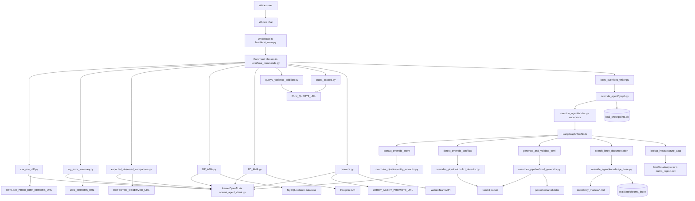
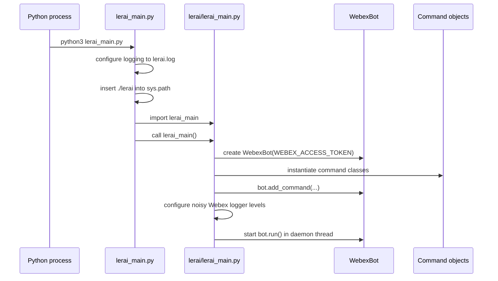
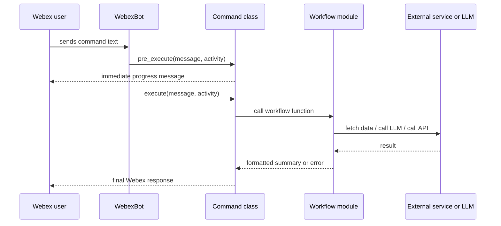
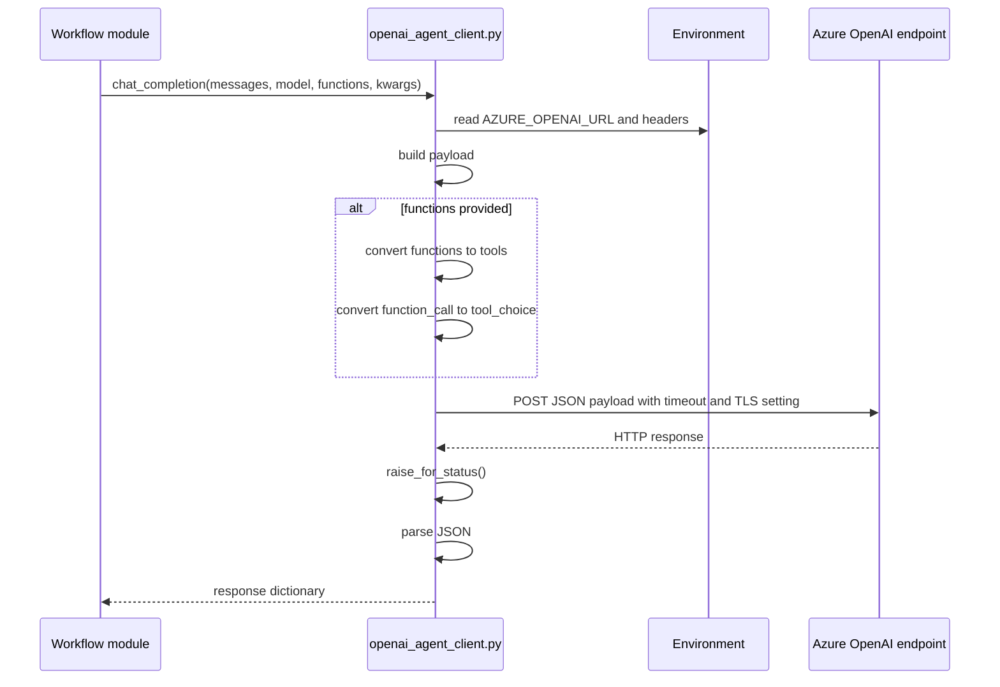
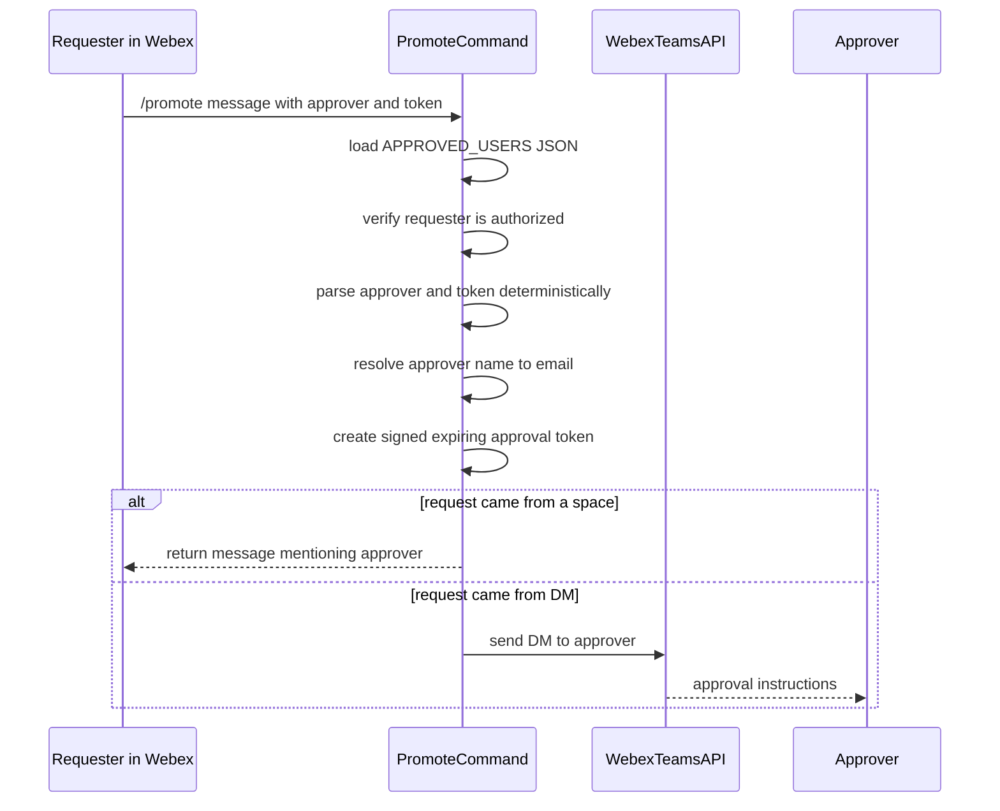
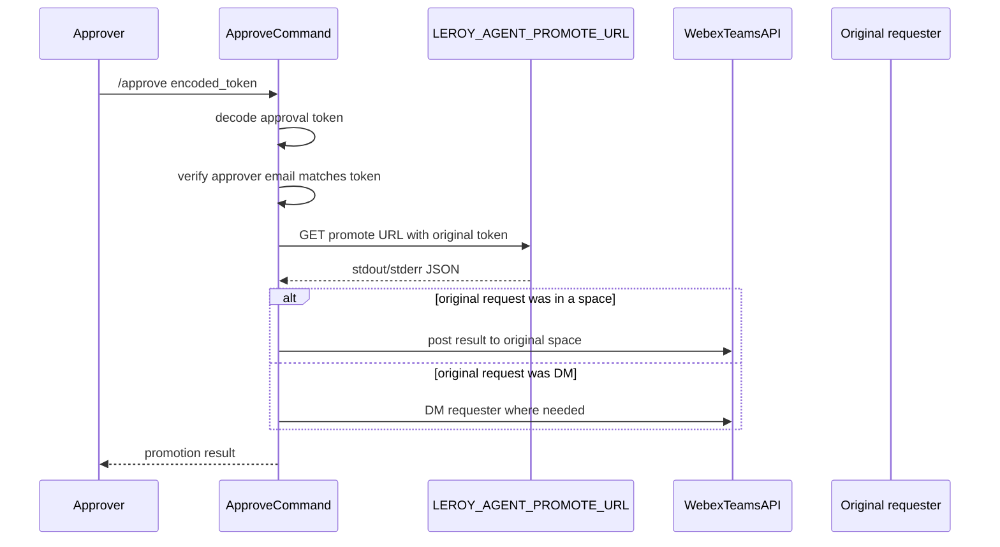

# LeRAI Project Flow

This document explains the current LeRAI codebase for a new maintainer. It describes what the project appears to do, how the modules fit together, what libraries are involved, and how requests move through the system.

The domain meanings below are inferred from code, prompt names, SQL, and command names. They should be reviewed by a project owner before being treated as authoritative operational definitions.

## Project Summary

LeRAI appears to be a Webex bot for operational workflows around Large Region infrastructure. Users interact with it through Webex commands. Each command calls a Python workflow that fetches data from internal services or databases, optionally asks Azure OpenAI to summarize or reason over that data, and returns a Webex message.

The bot currently supports these broad categories:

- Offline versus production CSV comparison.
- Airflow error log summarization.
- Expected versus observed offload analysis.
- Deployment project question answering.
- Footprint descriptor question answering with tool calls.
- Query2 variance and quota checks.
- LeROY promotion request and approval flow.
- Interactive LeROY override TOML generation with thread-aware pause/resume.
- LeROY override-adjacent question answering through documentation search and infrastructure lookups.

The code is mostly organized as one command router plus one module per workflow. There is no full application framework beyond the Webex bot library.

## Glossary: Needs Owner Confirmation

These terms appear in code but need a domain owner to confirm exact meanings:

| Term | Inferred meaning from code | Needs owner confirmation |
| --- | --- | --- |
| LR | Large Region. SQL filters use values like `LR%` and command names refer to LR operational checks. | Yes |
| DP | Deployment Project. `DP_AMA.py` queries `AK_DEPLOYMENT_PROJECT` and answers questions about DPs. | Yes |
| FD | Footprint Descriptor or Footprint Data. `/fd` uses Footprint API functions such as scheduled knees and predictions. | Yes |
| LeRAI | Name of this Webex operational assistant. It prints `LeRAI v1.6` at startup. | Yes |
| LeROY | Related promotion/override system. Code calls `LEROY_AGENT_PROMOTE_URL` and generates LeROY override TOML. | Yes |
| Query2 | Internal query execution or data source used for variance and quota checks. | Yes |
| ECOR | Mentioned in sample DP question comments, but not defined in code. | Yes |
| maprule | Footprint API parameter used with metro, quarter, traffic type, and network. | Yes |
| offload | Expected/observed traffic handling metric. Code compares expected and observed offload values. | Yes |
| footprint | Internal service/domain for traffic knees, scheduled metro quarters, and predictions. | Yes |
| variance | In Query2 code, appears to mean a vsize limit exception/addition needed for some LR regions. | Yes |
| quota | In Query2 code, object count or fp-config resource limits. | Yes |
| knee | Footprint API concept returned by scheduled knee endpoints. Exact meaning is domain-specific. | Yes |
| fp-config | Footprint configuration name used in quota checks. | Yes |

## Repository Layout

```text
lerai_main.py                         Root launcher.
override_schema.json                  Schema-like reference for LeROY override generation.
requirements.txt                      Runtime dependency list added during cleanup.
README.md                             Minimal project README.
openai_agent/openai_agent_client.py   Shared Azure OpenAI HTTP client.
lerai/                                Main application package.
lerai/override_agent/                 Interactive LangGraph supervisor and tool orchestration.
lerai/data/chroma_index/              Local persisted Chroma index for LeROY manual search (gitignored).
lerai/overrides_pipeline/             Deterministic extraction/conflict/validation utilities used by the agent.
lerai/netarch/                        Netarch database helpers and metro-region mapping exporter.
lerai/prompts/                        Prompt templates used by LLM workflows.
test_cli.py                           Local interactive CLI harness for the override agent.
tests/                                No-server unit tests for payload and parser behavior.
```

Important modules under `lerai/`:

| File | Role |
| --- | --- |
| `lerai/lerai_main.py` | Creates the Webex bot, registers commands, and starts the bot loop. |
| `lerai/lerai_commands.py` | Defines all Webex command classes and delegates to workflow modules. |
| `lerai/config.py` | Provides shared environment-variable parsing and validation helpers. |
| `lerai/logging_utils.py` | Provides shared redaction and logging helpers for command and workflow diagnostics. |
| `lerai/csv_env_diff.py` | Fetches offline/production diff output and asks the LLM to summarize it. |
| `lerai/log_error_summary.py` | Fetches Airflow error logs and asks the LLM to summarize them. |
| `lerai/expected_observed_comparison.py` | Fetches expected/observed offload data and asks the LLM to summarize it. |
| `lerai/DP_AMA.py` | Fetches LR deployment project data from MySQL and asks the LLM to answer questions. |
| `lerai/FD_AMA.py` | Implements a tool-calling LLM loop over Footprint API functions. |
| `lerai/query2_variance_addition.py` | Calls Query2 endpoint and formats regions needing vsize variance changes. |
| `lerai/quota_exceed.py` | Calls Query2 endpoint and formats quota/object-limit exceedance results. |
| `lerai/promote.py` | Implements promotion request and approval token flow. |
| `lerai/webex_presence.py` | Webex helper functions for presence, direct messages, spaces, and approver selection. |
| `lerai/leroy_overrides_writer.py` | Bridges Webex command traffic to the override LangGraph app, including thread-id resolution (native parent blocks, `parentId`, and Webex API fallback), interrupt resume behavior, and threaded reply handling. |
| `lerai/override_agent/graph.py` | Builds a singleton LangGraph app with a persistent SQLite checkpointer (`lerai_checkpoints.db`). |
| `lerai/override_agent/nodes.py` | Defines the supervisor node, Azure model wiring, tool routing, pretty-printed LLM request/response logging, and the initial input builder. |
| `lerai/override_agent/tools.py` | Defines supervisor tools: intent extraction, conflict detection, TOML generation/validation, LeROY manual search, and infrastructure lookups against local CSV data. |
| `lerai/override_agent/knowledge_base.py` | Builds a hybrid retriever over `docs/leroy_manual/` using Chroma plus BM25 and persists the local vector index in `lerai/data/chroma_index/`. |
| `lerai/override_agent/state.py` | Typed graph state (`messages`, `conflict_report`, `draft_toml`). |
| `lerai/overrides_pipeline/entity_extractor.py` | Uses LLM function/tool calling and optional Jira XML parsing to extract structured override intent. |
| `lerai/overrides_pipeline/conflict_detector.py` | Parses `override.toml` with `tomlkit` and performs semantic conflict detection. It resolves cross-scope relationships (`Region-default` -> `Region-geo` -> `Region-country` -> `Region-metro` -> `Region-number`) using CSV mappings in `lerai/data/`, validates requested map names against `lerai/data/maps.csv`, classifies map overlap (including all-map and partial overlap cases), compares directive compatibility (currently `Access-control`), and returns structured conflict entries such as `DIRECT_COLLISION`, `INEFFECTIVE`, `CARVE_OUT`, `DEAD_CODE`, and `PARTIAL_OVERLAP`. |
| `lerai/overrides_pipeline/toml_generator.py` | Builds `[[override-records]]` stanzas via `tomlkit` and validates records with `jsonschema` against `override_schema.json`. |
| `lerai/netarch/netarch.py` | Provides read/write Netarch connection helpers plus export utilities: `fetch_metro_region_mapping()` for region/metro mapping data and `fetch_maps()` for map shortname catalog generation in `lerai/data/maps.csv`. |
| `lerai/scheduled_jobs.py` | Contains daily report jobs; scheduler registration is currently commented out. |
| `lerai/mysql_client.py` | Opens MySQL connections and returns query results as CSV-like text. |
| `lerai/netarch_queries.py` | Stores SQL used by DP workflows. |

## High-Level Architecture



## Entry Point and Startup Flow

The root launcher is `lerai_main.py` at the repository root. It configures basic logging and inserts the `lerai/` directory into `sys.path`, then imports `lerai_main` from `lerai/lerai_main.py`.

Startup sequence:



The bot name is configured as `doombot`, and approved Webex domains are restricted to `akamai.com`.

The scheduler setup exists in `lerai/lerai_main.py`, but all scheduled job registration lines are commented out. That means scheduled jobs do not start by default in the current code.

## Command Dispatch Model

All active Webex commands are classes in `lerai/lerai_commands.py`. They inherit from `webex_bot.models.command.Command`.

Each command typically implements:

- `pre_execute(message, attachment_actions, activity)`: logs the user email, command, and raw message, then returns an immediate “please wait” response.
- `execute(message, attachment_actions, activity)`: calls the workflow function and returns the final Webex message.



Additional routing behavior in `lerai/lerai_main.py`:

- If a user posts in an existing Webex thread without typing an explicit command, the bot now auto-routes the message to `/write_override` so multi-turn override conversations continue naturally.

## Active Commands

| Command keyword | Class | Workflow function | What it does |
| --- | --- | --- | --- |
| `diff_offline_prod` | `CompareCsvEnvsCommand` | `compare_offline_vs_production()` | Fetches offline versus production diff output and summarizes it. |
| `airflow_errors` | `AirflowErrorSummaryCommand` | `get_airflow_error_summary()` | Fetches Airflow ERROR lines and summarizes failure patterns. |
| `expected_observed_diff` | `ExpectedObservedDiffCommand` | `run_offload_analysis_workflow()` | Fetches expected/observed offload data and summarizes underperformance. |
| `/dp` | `LRDPCommand` | `summarize_dps()` | Queries deployment project data and answers a DP question. |
| `/fd` | `footprintCommand` | `answer_footprint_question()` | Uses LLM tool calls to query Footprint APIs. |
| `/promote` | `PromoteCommand` | `handle_promotion_request()` | Creates a promotion approval request. |
| `/approve` | `ApproveCommand` | `handle_approval_request()` | Approves a pending promotion request. |
| `query_variance` | `QueryVarianceCommand` | `check_query2_for_variance_addition()` | Reports LR regions that need Query2 vsize variance addition. |
| `quota_exceed` | `QuotaExceedCommand` | `check_query2_for_quota_exceed()` | Reports fp-config or object-count quota exceedance. |
| `/write_override` | `LeroyOverrideWriterCommand` | `write_toml()` | Runs the interactive override agent with conversation persistence, conflict checks, interrupt/resume, and threaded Webex replies. |

Defined but not actively registered:

- `LRDPDevCommand`: development variant for DP answer/proof/verification flow.
- `SimulateDailyReport`: command to manually simulate daily CSV diff report.
- `SimulateDailyOffloadReport`: command to manually simulate daily offload report.

## Azure OpenAI Client Flow

All LLM workflows call `chat_completion()` or `responses()` from `openai_agent/openai_agent_client.py`.

Current behavior after the recent cleanup:

- Azure environment variables are read at call time, not import time.
- The client builds a request payload with `messages`, `model`, and `max_completion_tokens`.
- It passes supported generation controls such as `temperature`, `top_p`, `seed`, `response_format`, `metadata`, `user`, and `parallel_tool_calls`.
- Legacy `functions` arguments are converted locally to modern `tools` entries.
- `function_call` is converted to `tool_choice` for tool-calling requests.
- HTTP status is checked before JSON parsing.
- `AZURE_OPENAI_TIMEOUT` controls request timeout, defaulting to 30 seconds.
- `AZURE_OPENAI_VERIFY_SSL` controls TLS verification, defaulting to true.
- The `responses()` function is only a compatibility wrapper around `chat_completion()`.



## Workflow Details

### Offline vs Production CSV Diff

Code path:

- Command: `diff_offline_prod`
- Command class: `CompareCsvEnvsCommand`
- Module: `lerai/csv_env_diff.py`
- Main function: `compare_offline_vs_production()`

Flow:

1. Fetch raw JSON from `OFFLINE_PROD_DIFF_ERRORS_URL` using client certificate authentication from `CERT_PATH` and `KEY_PATH`.
2. Parse response JSON.
3. Require `returncode == 0`.
4. Extract `stdout` containing diff output.
5. Load `lerai/prompts/offline_prod_prompt.txt`.
6. Send prompt plus diff output to Azure OpenAI.
7. Return the LLM summary.

Important behavior:

- The function accepts `check_staleness_only` and `stale_hours`, but the current implementation always fetches and summarizes the diff output. Those parameters are not meaningfully used in the shown code.
- Non-empty stderr is logged as a warning (with redaction) but does not fail the command if return code is zero.

### Airflow Error Summary

Code path:

- Command: `airflow_errors`
- Command class: `AirflowErrorSummaryCommand`
- Module: `lerai/log_error_summary.py`
- Main function: `get_airflow_error_summary()`

Flow:

1. Fetch text from `LOG_ERRORS_URL` using client certificate authentication.
2. If the result is empty, return a “No ERROR lines found” message.
3. Build a prompt describing Airflow log ERROR lines.
4. Ask Azure OpenAI to group repeated errors and highlight failing tasks/DAG attempts.
5. Return the LLM summary.

### Expected vs Observed Offload

Code path:

- Command: `expected_observed_diff`
- Command class: `ExpectedObservedDiffCommand`
- Module: `lerai/expected_observed_comparison.py`
- Main function: `run_offload_analysis_workflow()`

Flow:

1. Fetch text from `EXPECTED_OBSERVED_URL` using client certificate authentication.
2. Load `lerai/prompts/expected_observed_summary_prompt.txt`.
3. Send prompt plus fetched text to Azure OpenAI.
4. Return the summary.

The file docstring describes expected and observed CSV joining/filtering logic, but the current code primarily fetches precomputed text and asks the LLM to summarize it. A maintainer should verify whether join/filtering happens upstream or is planned but not implemented in this module.

### DP Q&A

Code path:

- Command: `/dp`
- Command class: `LRDPCommand`
- Module: `lerai/DP_AMA.py`
- Main function: `summarize_dps(userquestion)`

Flow:

1. Run `query_LR_DP` from `lerai/netarch_queries.py` through `run_mysql_query()` in `lerai/mysql_client.py`.
2. Convert returned rows into CSV-like text.
3. Choose a prompt based on whether the user asked a specific question:
   - `dp_default_prompt.txt` if no question was supplied.
   - `dp_user_prompt.txt` plus the user question if there is a question.
4. Append DP data and `dp_prompt_tail.txt`.
5. Call Azure OpenAI with model `gpt-4.1` and `temperature=0`.
6. Return the response content.

The module also contains candidate-answer and verification helpers:

- `create_dp_candiate_answer()`
- `verify_dp_candiate_answer()`

The development command `LRDPDevCommand` uses these helpers and extracts `<answer>` and `<verdict>` tags with regular expressions, but that command is not registered in the active bot setup.

### Footprint API Q&A

Code path:

- Command: `/fd`
- Command class: `footprintCommand`
- Module: `lerai/FD_AMA.py`
- Main function: `answer_footprint_question(user_message)`

The module defines three tools for the LLM:

| Tool | Local function | Purpose |
| --- | --- | --- |
| `list_scheduled_metro_quarters` | `list_scheduled_metro_quarters()` | Lists metros and quarters with scheduled footprint descriptors. |
| `get_scheduled_knee` | `get_scheduled_knee(...)` | Fetches knee data for metro, quarter, maprule, traffic type, and network. |
| `get_scheduled_knee_prediction` | `get_scheduled_knee_prediction(...)` | Fetches knee or traffic prediction data. |

Flow:

1. Build a system message telling the model it is an expert in the footprint descriptor API.
2. Call Azure OpenAI with the tool definitions.
3. If the model returns `tool_calls`, execute each requested local function.
4. Append each tool result back to the conversation as a `tool` role message.
5. Repeat for up to five steps.
6. Return the final assistant content.

The module also contains `answer_footprint_question_legacy()`, which handles legacy `function_call` responses. The active command uses the modern `answer_footprint_question()` function.

### Query2 Variance Check

Code path:

- Command: `query_variance`
- Command class: `QueryVarianceCommand`
- Module: `lerai/query2_variance_addition.py`
- Main function: `check_query2_for_variance_addition(silent=False)` when called by command

Flow:

1. Build a SQL query that looks for regions whose average `vsize_limit` is below a threshold.
2. Send the query to `RUN_QUERY2_URL` using URL query parameters and client certificate authentication.
3. Parse service response JSON with fields `returncode`, `stdout`, and `stderr`.
4. Treat non-empty stderr or non-zero return code as an error string.
5. Parse `stdout` using `ast.literal_eval()` because the service returns a Python-list-like string.
6. Return either an “all regions up to date” message or a bullet list of regions needing variance addition.

### Query2 Quota Exceed Check

Code path:

- Command: `quota_exceed`
- Command class: `QuotaExceedCommand`
- Module: `lerai/quota_exceed.py`
- Main function: `check_query2_for_quota_exceed(silent=False)` when called by command

Flow:

1. Build a SQL query checking fp-config object counts and machine object limits.
2. Send the query to `RUN_QUERY2_URL` with client certificate authentication.
3. Parse service response JSON.
4. Parse `stdout` with `ast.literal_eval()`.
5. Return a message listing regions/configs that exceed quotas or object limits.

### Promotion Request and Approval

Code paths:

- Request command: `/promote`
- Request function: `handle_promotion_request(message, activity)`
- Approval command: `/approve`
- Approval function: `handle_approval_request(message, activity)`

Request flow:



Approval flow:



Token format:

```text
v2.<base64url-json-payload>.<base64url-hmac-signature>
```

The JSON payload contains the requester, approver, source Webex space, original LeROY token, timestamp, and token version. The signature is HMAC-SHA256 and requires `PROMOTION_TOKEN_SECRET`. The current implementation also enforces token freshness using `PROMOTION_TOKEN_TTL_SECONDS`, defaulting to 3600 seconds.

### Webex Presence Helpers

Module: `lerai/webex_presence.py`

Functions:

- `get_webex_status(webex_api, email)`: fetches a user's Webex status.
- `is_ooo(webex_api, email)`: returns true only if status is `OutOfOffice`.
- `pick_approver(webex_api, approved_users, requester)`: selects the first non-requester who is not OOO.
- `send_dm(webex_api, to_email, message)`: sends direct message.
- `send_space_message(webex_api, room_id, message)`: posts to a Webex space.
- `get_sender_email(activity)`: extracts sender email from Webex activity.
- `get_space_id(activity)`: returns a group space id, or empty string for one-on-one messages.

The current `promote.py` imports these helpers, but its request flow currently resolves an explicitly requested approver rather than calling `pick_approver()`.

### LeROY Override Writer

Code path:

- Command: `/write_override`
- Command class: `LeroyOverrideWriterCommand`
- Module: `lerai/leroy_overrides_writer.py`
- Main function: `write_toml(user_question, xml_string=None)`

Flow:

1. Create or reuse the singleton LangGraph app from `lerai/override_agent/graph.py`.
2. Resolve a stable `thread_id` for the Webex conversation:
    - use a native message `parent.id` block when present,
    - otherwise prefer `parentId` when available,
    - otherwise fall back to message `id`,
    - and optionally verify parent mapping by calling Webex API using a base64-encoded Webex Global ID when needed.
3. Check graph state for this thread. If there is a pending interrupt (`current_state.next` is non-empty), resume with `Command(resume=...)`; otherwise seed a new turn with `build_initial_input(...)`.
4. Run the supervisor with routing instructions from `lerai/prompts/override_agent_supervisor_system_prompt.txt`:
    - conceptual/rules/architecture questions are routed to `search_leroy_documentation`,
    - infrastructure/mapping questions are routed to `lookup_infrastructure_data`,
    - transactional override requests are routed through `extract_override_intent` -> `generate_and_validate_toml` -> `detect_override_conflicts`.
5. `search_leroy_documentation` uses a hybrid retriever over `docs/leroy_manual/`:
    - Chroma vector search with `sentence-transformers/all-MiniLM-L6-v2`,
    - BM25 lexical retrieval,
    - `EnsembleRetriever` weighting both result sets,
    - persisted local index data under `lerai/data/chroma_index/`.
6. `lookup_infrastructure_data` answers exact lookups from local CSV data:
    - `map`: validates a map shortname against `lerai/data/maps.csv`,
    - `region`: returns metros for a region id from `lerai/data/metro_region.csv`,
    - `metro`: returns regions for a metro from `lerai/data/metro_region.csv`.
7. `nodes.py` logs pretty-printed LLM request and response payloads, including decoded nested JSON tool arguments/results, to make override-agent debugging readable.
8. If graph returns `__interrupt__`, return that interrupt text to user and wait for next reply in the same thread.
9. If a final AI response is produced:
    - in Webex mode, post as a threaded reply (`parentId=thread_id`) and return `None` to command handler,
    - in local/CLI mode, return the markdown text directly.

Key behaviors in the current implementation:

- Conversation state is persisted by thread id in `lerai_checkpoints.db`, enabling multi-turn refinement instead of one-shot static tool calling.
- The same supervisor can now answer LeROY conceptual questions and exact infrastructure lookup questions without generating TOML.
- Conflict handling now returns typed semantic findings to the supervisor; the generated TOML can still be presented with warnings attached, rather than being automatically blocked in all conflict scenarios.
- Conflict checks now also return map-name warnings when a requested map is not found in `lerai/data/maps.csv`, including `warnings` and `invalid_mapnames` fields in tool output.
- The writer now has robust room/thread extraction for varied Webex activity payload shapes.
- Follow-up threaded messages with no explicit command keyword are automatically treated as `/write_override` turns by the command router.
- The local documentation index lives in `lerai/data/chroma_index/` and is ignored by git so retrieval artifacts do not show up as source changes.
- Deterministic safety checks remain in place through `overrides_pipeline/conflict_detector.py` and `overrides_pipeline/toml_generator.py`.

### Scheduled Jobs

Module: `lerai/scheduled_jobs.py`

Functions:

- `send_daily_csv_diff_report()`
- `send_daily_offload_report()`
- `send_daily_query2_variance_report()`
- `send_daily_quota_exceed_report()`

These functions can post reports to Webex spaces. However, scheduler registration in `lerai/lerai_main.py` is commented out, so these jobs are not started by default.

## Configuration Reference

### Webex

| Variable | Used by | Purpose |
| --- | --- | --- |
| `WEBEX_ACCESS_TOKEN` | `lerai/lerai_main.py`, `lerai/scheduled_jobs.py`, `lerai/promote.py` | Bot/API token for Webex. |
| `WEBEX_SPACE_ID` | `lerai/lerai_main.py`, `lerai/scheduled_jobs.py` | Main/default Webex space for reports. |
| `LR_OFFLOAD_WEBEX_SPACE_ID` | `lerai/scheduled_jobs.py` | Space for offload watch reports. |
| `APPROVED_USERS` | `lerai/promote.py` | JSON map of authorized names to email addresses. |
| `PROMOTION_TOKEN_SECRET` | `lerai/promote.py` | Required secret used to sign and verify promotion approval tokens. |
| `PROMOTION_TOKEN_TTL_SECONDS` | `lerai/promote.py` | Optional approval token lifetime in seconds. Defaults to 3600. |

### Azure OpenAI

| Variable | Used by | Purpose |
| --- | --- | --- |
| `AZURE_OPENAI_URL` | `openai_agent/openai_agent_client.py` | Chat/completions endpoint URL. |
| `AZURE_API_KEY` | `openai_agent/openai_agent_client.py` | Azure OpenAI API key. |
| `AZURE_USER_ID` | `openai_agent/openai_agent_client.py` | User identity header. |
| `AZURE_APP_NAME` | `openai_agent/openai_agent_client.py` | Application identity header. |
| `AZURE_OPENAI_TIMEOUT` | `openai_agent/openai_agent_client.py` | Optional request timeout in seconds. Defaults to 30. |
| `AZURE_OPENAI_VERIFY_SSL` | `openai_agent/openai_agent_client.py` | Optional TLS verification toggle. Defaults to true. |
| `AZURE_OPENAI_MODEL` | `lerai/override_agent/nodes.py` | Model name used by override supervisor (defaults to `GPT-5.2`). |
| `REQUESTS_CA_BUNDLE` | `lerai/override_agent/nodes.py` | Optional CA bundle path used by the `httpx` client for override agent requests. |

### Database

| Variable | Used by | Purpose |
| --- | --- | --- |
| `MYSQL_HOST` | `lerai/mysql_client.py` | MySQL host. |
| `MYSQL_USER` | `lerai/mysql_client.py` | MySQL user. |
| `MYSQL_DATABASE` | `lerai/mysql_client.py` | MySQL database. |
| `MYSQL_PASSWORD` | `lerai/mysql_client.py` | MySQL password. |

### Client Certificate and Internal Endpoints

| Variable | Used by | Purpose |
| --- | --- | --- |
| `CERT_PATH` | HTTP/mTLS modules | Client certificate file path. |
| `KEY_PATH` | HTTP/mTLS modules | Client key file path. |
| `FOOTPRINT_API_BASE_URL` | `lerai/FD_AMA.py`, some shared modules | Footprint API base URL. |
| `OFFLINE_PROD_DIFF_ERRORS_URL` | `lerai/csv_env_diff.py` | Offline/production diff endpoint. |
| `EXPECTED_OBSERVED_URL` | `lerai/expected_observed_comparison.py` | Expected/observed offload endpoint. |
| `LOG_ERRORS_URL` | `lerai/log_error_summary.py` | Airflow log error endpoint. |
| `RUN_QUERY2_URL` | `lerai/query2_variance_addition.py`, `lerai/quota_exceed.py` | Query2 execution endpoint. |
| `LEROY_AGENT_PROMOTE_URL` | `lerai/promote.py` | LeROY promotion execution endpoint. |

## Prompt Templates

Prompt files live under `lerai/prompts/`.

| Prompt file | Used by | Purpose |
| --- | --- | --- |
| `dp_default_prompt.txt` | `DP_AMA.py` | DP summary prompt when no user question is provided. |
| `dp_user_prompt.txt` | `DP_AMA.py` | DP prompt prefix when a user question is provided. |
| `dp_prompt_tail.txt` | `DP_AMA.py` | Tail appended after DP data. |
| `dp_proof_prompt.txt` | `DP_AMA.py` | Candidate answer/proof prompt. |
| `dp_proof_tail_prompt.txt` | `DP_AMA.py` | Tail appended after proof prompt data. |
| `dp_proof_check_prompt.txt` | `DP_AMA.py` | Verification prompt for candidate answer/proof. |
| `dp_proof_check_tail_prompt.txt` | `DP_AMA.py` | Tail appended to proof-check prompt. |
| `expected_observed_summary_prompt.txt` | `expected_observed_comparison.py` | Expected/observed offload summary instructions. |
| `leroy_overrides_writer_prompt.txt` | legacy override writer path | Legacy prompt retained in repo but not used by the current deterministic pipeline. |
| `offline_prod_prompt.txt` | `csv_env_diff.py` | Offline versus production diff summary instructions. |
| `leroy_override_conflict_rules.json` | `overrides_pipeline/conflict_detector.py` | Defines `scope_keys` and `metadata_keys` used to parse existing override records before semantic scope/directive comparison. |
| `leroy_override_entity_extractor_settings.json` | `overrides_pipeline/entity_extractor.py` | Configures extraction parameters such as model name, token limits, and Jira field mappings used by the entity extractor. |
| `leroy_override_entity_extractor_system_prompt.txt` | `overrides_pipeline/entity_extractor.py` | System message instructing the LLM how to extract structured override intent from user input and optional Jira XML. |
| `leroy_override_entity_extractor_tool.json` | `overrides_pipeline/entity_extractor.py` | Tool/function schema definition passed to the LLM for structured tool-call extraction of override intent. |
| `leroy_override_entity_extractor_user_prompt.txt` | `overrides_pipeline/entity_extractor.py` | User message template wrapping the user question (and optional Jira context) sent to the LLM. |
| `override_agent_supervisor_system_prompt.txt` | `override_agent/nodes.py` | Supervisor instruction set for request routing, conflict handling, context synthesis across user turns, and multi-scope/multi-directive request handling. The current prompt routes conceptual questions to `search_leroy_documentation`, infrastructure questions to `lookup_infrastructure_data`, requires schema-grounded answers for structural constraints, and requires `extract_override_intent` -> `generate_and_validate_toml` -> `detect_override_conflicts` for transactional override requests. It also asks the assistant to present TOML plus conflict-type-specific warnings (`DIRECT_COLLISION`, `INEFFECTIVE`, `CARVE_OUT`, `DEAD_CODE`, `PARTIAL_OVERLAP`) when applicable, and requires Cartesian-product handling when a request spans multiple scopes and multiple directives. |
| `leroy_override_writer_response_templates.json` | `lerai/leroy_overrides_writer.py` | Markdown response templates for override generation outcomes and conflict/warning messaging returned to the Webex user. |

## Libraries Used

| Library | Why it is used |
| --- | --- |
| `webex-bot` | Provides `WebexBot` and `Command` abstractions for Webex command handling. |
| `webexteamssdk` | Sends Webex messages and queries Webex people/status APIs. |
| `requests` | Sends HTTP requests to Azure OpenAI, Footprint API, and LeROY promotion endpoint. |
| `httpx` | Used by the override agent supervisor LLM client wiring in `override_agent/nodes.py`. |
| `pymysql` | Connects to MySQL/netarch database and returns rows. |
| `apscheduler` | Provides `BackgroundScheduler`; scheduler jobs exist but are currently commented out. |
| `langgraph` | Provides stateful graph orchestration, ToolNode execution, and SQLite checkpointing for the interactive override agent. |
| `langchain-core`, `langchain-openai` | Provide message/tool abstractions and AzureChatOpenAI integration used by the override supervisor node. |
| `langchain-chroma` | Provides the persisted vector store used by the LeROY manual knowledge base. |
| `langchain-huggingface` | Provides embedding generation for the LeROY manual knowledge base. |
| `langchain-text-splitters` | Splits LeROY markdown manuals into retrieval chunks with header metadata preserved. |
| `langchain-community`, `rank-bm25` | Provide BM25 lexical retrieval and ensemble retrieval support for the hybrid knowledge base. |
| `tomlkit` | Parses live `override.toml` and builds AST-preserving override stanzas. |
| `jsonschema` | Validates generated override records against `override_schema.json`. |
| `urllib.request`, `urllib.parse`, `ssl` | Used for certificate-authenticated internal HTTP endpoints. |
| `unittest` | Used for no-server tests under `tests/`. |

## Tests and No-Server Validation

For a detailed explanation of every current test, see `docs/TEST_GUIDE.md`.
For the first live-server access window, see `archive/SERVER_ACCESS_NEXT_STEPS.md`.

Current tests:

| File | What it checks |
| --- | --- |
| `tests/test_openai_agent_client.py` | Payload construction for model/generation controls and legacy function-to-tool conversion. |
| `tests/test_query_response_parsing.py` | Query2 variance/quota parser behavior for empty and non-empty results. |
| `tests/test_promote_security.py` | Deterministic promote parsing, signed approval token round trip, tamper rejection, expiry, and missing-secret behavior. |
| `tests/test_dp_ama_state.py` | DP functions use request-scoped data and no longer expose `dplist_save`. |
| `tests/test_config.py` | Shared configuration helper behavior for required, optional, integer, boolean, JSON, and file-based settings. |
| `tests/test_entity_extractor_normalization.py` | Geographical scope normalization: geo name-to-code mapping, `Region-default` coercion, global-word collapsing, and metro space-to-underscore conversion. |
| `tests/test_leroy_overrides_writer_query_cases.py` | End-to-end TOML generation matches fixture-defined expected stanzas for a range of query patterns. |
| `tests/test_leroy_overrides_writer_conflicts_with_fixture.py` | Conflict detection against a fixture `override.toml`: verifies conflict messaging paths and clean/no-conflict paths. |
| `tests/test_mapname_validation.py` | Map-name validation against `lerai/data/maps.csv`, including invalid-map warning payloads from `detect_override_conflicts`. |
| `tests/test_logging_utils.py` | Redaction behavior for sensitive mapping keys, emails, bearer tokens, and inline secret assignments. |

Useful no-server validation commands:

```bash
python3 -m unittest tests.test_openai_agent_client tests.test_query_response_parsing tests.test_promote_security tests.test_dp_ama_state tests.test_config tests.test_logging_utils tests.test_mapname_validation
python3 -m compileall .
```

These tests do not run the Webex bot or contact Azure, Webex, MySQL, or internal services.

## Recent Cleanup Note

A recent cleanup pass made the following static changes:

- Added missing imports in promotion and Query2 modules.
- Removed duplicate imports in a few modules.
- Hardened `openai_agent/openai_agent_client.py` by removing the global `requests.post` monkey patch, honoring model and generation kwargs, adding timeout handling, and improving HTTP error behavior.
- Added `requirements.txt`.
- Added no-server unit tests for LLM payload construction and Query2 response parsing.
- Hardened promotion approval tokens with HMAC signing and TTL validation, and replaced LLM-based `/promote` extraction with deterministic parsing.
- Removed `DP_AMA.py` module-level `dplist_save` state in favor of request-scoped DP data.
- Added no-server unit tests for promotion security and DP state isolation.
- Added `lerai/config.py` with shared environment parsing helpers and tests.
- Hardened Query2 variance/quota response parsing for malformed JSON, bad row shapes, corrected quota headers, and non-numeric quota values.
- Added `lerai/logging_utils.py` and replaced active high-risk `print()` calls with structured logging and redaction.
- Replaced the legacy override writer path with modular pipeline stages in `lerai/overrides_pipeline/`.
- Added deterministic TOML construction and schema validation for `/write_override` using `tomlkit` and `jsonschema`.

The most recent changes further changed the override architecture:

- Added `lerai/override_agent/` with a LangGraph supervisor + ToolNode flow for `/write_override`.
- Added persistent graph checkpointing in `lerai_checkpoints.db` keyed by Webex thread id.
- Updated `/write_override` to support interruption/resume across user turns in the same thread.
- Improved Webex thread/room extraction with parent-id fallback and API verification paths.
- Added `test_cli.py` as a local interactive harness for manual multi-turn testing of interrupts and resume behavior.
- Added `lerai/override_agent/knowledge_base.py` to support hybrid LeROY manual retrieval using Chroma + BM25.
- Added `search_leroy_documentation` and `lookup_infrastructure_data` as first-class supervisor tools for non-transactional override questions.
- Updated `override_agent/nodes.py` to log pretty-printed LLM request/response payloads, including nested JSON decoding for readability.
- Updated `override_agent_supervisor_system_prompt.txt` to route conceptual questions, infrastructure lookups, schema-bound constraint questions, and transactional override requests to different tool paths.
- Updated `test_cli.py` to write timestamped logs under `logs/test_cli/` instead of a single repo-root log file.
- Added hybrid-retrieval dependencies to `requirements.txt` and ignored the generated `lerai/data/chroma_index/` directory in `.gitignore`.

Additional local branch updates reflected in this document:

- Updated `lerai/lerai_main.py` command routing so threaded follow-up messages without an explicit command keyword are auto-routed to `/write_override`.
- Updated `lerai/leroy_overrides_writer.py` thread-id extraction to check native parent blocks first and use base64-encoded Webex Global IDs for API fallback lookup.
- Added `lerai/netarch/netarch.py` as a package-local Netarch helper and mapping exporter used by override conflict detection.
- Added `fetch_maps()` in `lerai/netarch/netarch.py` and generated `lerai/data/maps.csv` as the map shortname catalog used for validation.
- Updated `lerai/overrides_pipeline/conflict_detector.py` from literal overlap checks to hierarchical semantic conflict classification backed by `lerai/data/metro_region.csv`, `lerai/data/country_metro.csv`, and `lerai/data/geo_country.csv`.
- Updated `lerai/overrides_pipeline/conflict_detector.py` to validate intent `Mapnames` against `lerai/data/maps.csv` and return unknown map names.
- Updated `lerai/override_agent/tools.py` conflict tool output to include structured `conflicts` in all return paths plus map-validation `warnings` and `invalid_mapnames`.
- Updated `lerai/prompts/override_agent_supervisor_system_prompt.txt` to enforce multi-directive extraction and Cartesian-product handling across multiple scopes and directives.
- Refreshed `lerai/data/metro_region.csv` with an additional Los Angeles (`FABRIC-LAX2`) mapping row.

Additional historical architecture notes are in `archive/`.


### LeRoy Documentation Reference

The following LeRoy documentation files are present in `docs/leroy_manual`.

**LeRoy Overrides.md**

- **Purpose:** The definitive syntax and behavior guide for the `override.toml` file.    
- **Contents:** Defines the strict rules for override records, specifically that each record must contain exactly one geographical scope and one override directive. It catalogs all acceptable geographical scopes (e.g., Region-geo, Region-country) and lists all available override directives (e.g., Access-control, Quota-tb) with examples. This is the most critical file for understanding override logic.

**LeRoy Change Safety.md**

- **Purpose:** The operational playbook for safely testing and deploying changes to LeRoy.
- **Contents:** Outlines the mandatory procedures for pre-deployment validation, including using the offline instance to generate output diffs and passing results through the FCS Validation API. It explains the team roles (Author, Reviewer, Deployer) and details the metrics used to ensure a change has not caused network instability.

**LeRoy Design Doc_ LR Maprule and Quota Management.md**

- **Purpose:** The core architectural blueprint explaining how LeRoy operates under the hood.
- **Contents:** Details the Maprule Placement Algorithms, including the math behind how LeRoy balances disk and flit constraints while prioritizing "sticky" maps. It also illustrates how LeRoy orchestrates its decisions with downstream systems like BLC and FCS.

**LeRoy dynamic config variables.md**

- **Purpose:** The reference sheet for tweaking LeRoy's overarching behavior and safety thresholds.
- **Contents:** Provides a comprehensive table of parameters found in `dynamic_config.json`, alongside their default values and operational descriptions. It outlines the exact percentage thresholds that dictate when LeRoy will fire an alert versus when it will completely abort a run.

**Region Distributed Cache For Large Regions.md**

- **Purpose:** Explains the foundational networking and caching architecture that necessitates LeRoy.
- **Contents:** Details how Large Regions optimize storage by splitting the cache into an "Edge Serial Cache" (for popular items) and a "Long Tail Cache" (distributed across the region to prevent duplication). It explains the Ghost Object Placement System (GOPS) and why traditional discovery protocols were abandoned in favor of deterministic object location.
