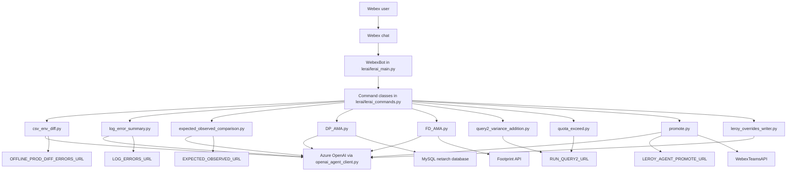
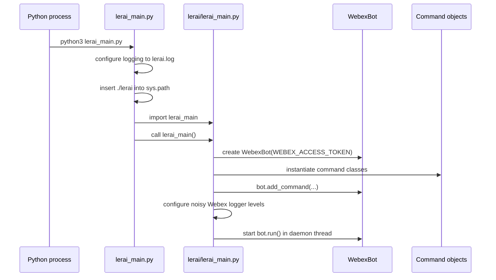
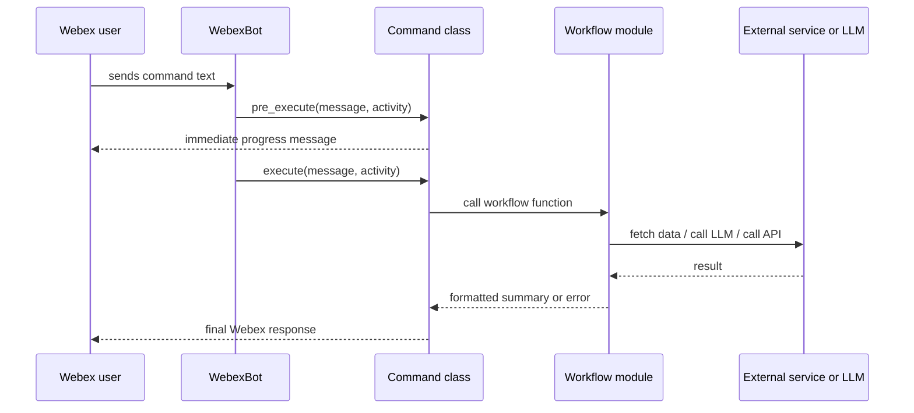
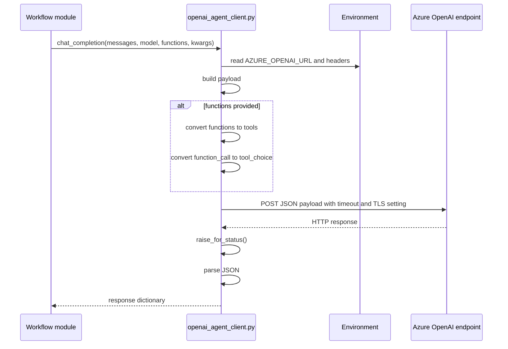
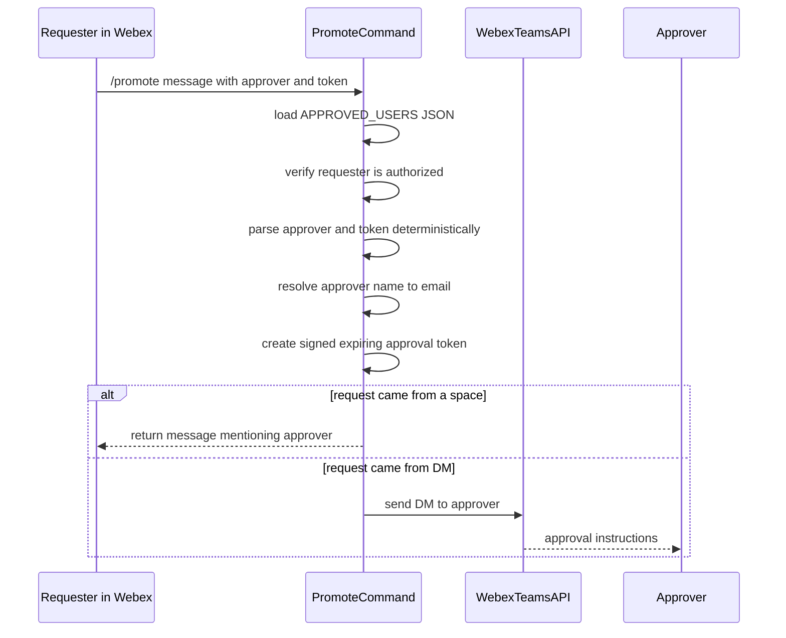
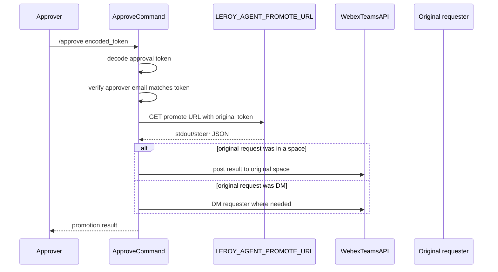

# LeRAI Project Flow

This document explains the current LeRAI codebase for a new maintainer. It describes what the project appears to do, how the modules fit together, what libraries are involved, and how requests move through the system.

The domain meanings below are inferred from code, prompt names, SQL, and command names. They should be reviewed by a project owner before being treated as authoritative operational definitions.

## Project Summary

LeRAI appears to be a Webex bot for operational workflows around Large Region infrastructure. Users interact with it through Webex commands. Each command calls a Python workflow that fetches data from internal services or databases, optionally asks Azure OpenAI to summarize or reason over that data, and returns a Webex message.

The bot currently supports these broad categories:

- Offline versus production CSV comparison.
- Airflow error log summarization.
- Expected versus observed offload analysis.
- Deployment project question answering.
- Footprint descriptor question answering with tool calls.
- Query2 variance and quota checks.
- LeROY promotion request and approval flow.
- LeROY override TOML generation.

The code is mostly organized as one command router plus one module per workflow. There is no full application framework beyond the Webex bot library.

## Glossary: Needs Owner Confirmation

These terms appear in code but need a domain owner to confirm exact meanings:

| Term | Inferred meaning from code | Needs owner confirmation |
| --- | --- | --- |
| LR | Large Region. SQL filters use values like `LR%` and command names refer to LR operational checks. | Yes |
| DP | Deployment Project. `DP_AMA.py` queries `AK_DEPLOYMENT_PROJECT` and answers questions about DPs. | Yes |
| FD | Footprint Descriptor or Footprint Data. `/fd` uses Footprint API functions such as scheduled knees and predictions. | Yes |
| LeRAI | Name of this Webex operational assistant. It prints `LeRAI v1.6` at startup. | Yes |
| LeROY | Related promotion/override system. Code calls `LEROY_AGENT_PROMOTE_URL` and generates LeROY override TOML. | Yes |
| Query2 | Internal query execution or data source used for variance and quota checks. | Yes |
| ECOR | Mentioned in sample DP question comments, but not defined in code. | Yes |
| maprule | Footprint API parameter used with metro, quarter, traffic type, and network. | Yes |
| offload | Expected/observed traffic handling metric. Code compares expected and observed offload values. | Yes |
| footprint | Internal service/domain for traffic knees, scheduled metro quarters, and predictions. | Yes |
| variance | In Query2 code, appears to mean a vsize limit exception/addition needed for some LR regions. | Yes |
| quota | In Query2 code, object count or fp-config resource limits. | Yes |
| knee | Footprint API concept returned by scheduled knee endpoints. Exact meaning is domain-specific. | Yes |
| fp-config | Footprint configuration name used in quota checks. | Yes |

## Repository Layout

```text
lerai_main.py                         Root launcher.
override_schema.json                  Schema-like reference for LeROY override generation.
requirements.txt                      Runtime dependency list added during cleanup.
README.md                             Minimal project README.
openai_agent/openai_agent_client.py   Shared Azure OpenAI HTTP client.
lerai/                                Main application package.
lerai/prompts/                        Prompt templates used by LLM workflows.
tests/                                No-server unit tests for payload and parser behavior.
```

Important modules under `lerai/`:

| File | Role |
| --- | --- |
| `lerai/lerai_main.py` | Creates the Webex bot, registers commands, and starts the bot loop. |
| `lerai/lerai_commands.py` | Defines all Webex command classes and delegates to workflow modules. |
| `lerai/csv_env_diff.py` | Fetches offline/production diff output and asks the LLM to summarize it. |
| `lerai/log_error_summary.py` | Fetches Airflow error logs and asks the LLM to summarize them. |
| `lerai/expected_observed_comparison.py` | Fetches expected/observed offload data and asks the LLM to summarize it. |
| `lerai/DP_AMA.py` | Fetches LR deployment project data from MySQL and asks the LLM to answer questions. |
| `lerai/FD_AMA.py` | Implements a tool-calling LLM loop over Footprint API functions. |
| `lerai/query2_variance_addition.py` | Calls Query2 endpoint and formats regions needing vsize variance changes. |
| `lerai/quota_exceed.py` | Calls Query2 endpoint and formats quota/object-limit exceedance results. |
| `lerai/promote.py` | Implements promotion request and approval token flow. |
| `lerai/webex_presence.py` | Webex helper functions for presence, direct messages, spaces, and approver selection. |
| `lerai/leroy_overrides_writer.py` | Generates TOML override stanzas from `override_schema.json` and ticket text using the LLM. |
| `lerai/scheduled_jobs.py` | Contains daily report jobs; scheduler registration is currently commented out. |
| `lerai/mysql_client.py` | Opens MySQL connections and returns query results as CSV-like text. |
| `lerai/netarch_queries.py` | Stores SQL used by DP workflows. |

## High-Level Architecture



## Entry Point and Startup Flow

The root launcher is `lerai_main.py` at the repository root. It configures basic logging and inserts the `lerai/` directory into `sys.path`, then imports `lerai_main` from `lerai/lerai_main.py`.

Startup sequence:



The bot name is configured as `SatyaSundar`, and approved Webex domains are restricted to `akamai.com`.

The scheduler setup exists in `lerai/lerai_main.py`, but all scheduled job registration lines are commented out. That means scheduled jobs do not start by default in the current code.

## Command Dispatch Model

All active Webex commands are classes in `lerai/lerai_commands.py`. They inherit from `webex_bot.models.command.Command`.

Each command typically implements:

- `pre_execute(message, attachment_actions, activity)`: logs the user email, command, and raw message, then returns an immediate “please wait” response.
- `execute(message, attachment_actions, activity)`: calls the workflow function and returns the final Webex message.



## Active Commands

| Command keyword | Class | Workflow function | What it does |
| --- | --- | --- | --- |
| `diff_offline_prod` | `CompareCsvEnvsCommand` | `compare_offline_vs_production()` | Fetches offline versus production diff output and summarizes it. |
| `airflow_errors` | `AirflowErrorSummaryCommand` | `get_airflow_error_summary()` | Fetches Airflow ERROR lines and summarizes failure patterns. |
| `expected_observed_diff` | `ExpectedObservedDiffCommand` | `run_offload_analysis_workflow()` | Fetches expected/observed offload data and summarizes underperformance. |
| `/dp` | `LRDPCommand` | `summarize_dps()` | Queries deployment project data and answers a DP question. |
| `/fd` | `footprintCommand` | `answer_footprint_question()` | Uses LLM tool calls to query Footprint APIs. |
| `/promote` | `PromoteCommand` | `handle_promotion_request()` | Creates a promotion approval request. |
| `/approve` | `ApproveCommand` | `handle_approval_request()` | Approves a pending promotion request. |
| `query_variance` | `QueryVarianceCommand` | `check_query2_for_variance_addition()` | Reports LR regions that need Query2 vsize variance addition. |
| `quota_exceed` | `QuotaExceedCommand` | `check_query2_for_quota_exceed()` | Reports fp-config or object-count quota exceedance. |
| `/write_override` | `LeroyOverrideWriterCommand` | `write_toml()` | Generates a LeROY override TOML stanza from user text. |

Defined but not actively registered:

- `LRDPDevCommand`: development variant for DP answer/proof/verification flow.
- `SimulateDailyReport`: command to manually simulate daily CSV diff report.
- `SimulateDailyOffloadReport`: command to manually simulate daily offload report.

## Azure OpenAI Client Flow

All LLM workflows call `chat_completion()` or `responses()` from `openai_agent/openai_agent_client.py`.

Current behavior after the recent cleanup:

- Azure environment variables are read at call time, not import time.
- The client builds a request payload with `messages`, `model`, and `max_completion_tokens`.
- It passes supported generation controls such as `temperature`, `top_p`, `seed`, `response_format`, `metadata`, `user`, and `parallel_tool_calls`.
- Legacy `functions` arguments are converted locally to modern `tools` entries.
- `function_call` is converted to `tool_choice` for tool-calling requests.
- HTTP status is checked before JSON parsing.
- `AZURE_OPENAI_TIMEOUT` controls request timeout, defaulting to 30 seconds.
- `AZURE_OPENAI_VERIFY_SSL` controls TLS verification, defaulting to true.
- The `responses()` function is only a compatibility wrapper around `chat_completion()`.



## Workflow Details

### Offline vs Production CSV Diff

Code path:

- Command: `diff_offline_prod`
- Command class: `CompareCsvEnvsCommand`
- Module: `lerai/csv_env_diff.py`
- Main function: `compare_offline_vs_production()`

Flow:

1. Fetch raw JSON from `OFFLINE_PROD_DIFF_ERRORS_URL` using client certificate authentication from `CERT_PATH` and `KEY_PATH`.
2. Parse response JSON.
3. Require `returncode == 0`.
4. Extract `stdout` containing diff output.
5. Load `lerai/prompts/offline_prod_prompt.txt`.
6. Send prompt plus diff output to Azure OpenAI.
7. Return the LLM summary.

Important behavior:

- The function accepts `check_staleness_only` and `stale_hours`, but the current implementation always fetches and summarizes the diff output. Those parameters are not meaningfully used in the shown code.
- Non-empty stderr is printed as a warning but does not fail the command if return code is zero.

### Airflow Error Summary

Code path:

- Command: `airflow_errors`
- Command class: `AirflowErrorSummaryCommand`
- Module: `lerai/log_error_summary.py`
- Main function: `get_airflow_error_summary()`

Flow:

1. Fetch text from `LOG_ERRORS_URL` using client certificate authentication.
2. If the result is empty, return a “No ERROR lines found” message.
3. Build a prompt describing Airflow log ERROR lines.
4. Ask Azure OpenAI to group repeated errors and highlight failing tasks/DAG attempts.
5. Return the LLM summary.

### Expected vs Observed Offload

Code path:

- Command: `expected_observed_diff`
- Command class: `ExpectedObservedDiffCommand`
- Module: `lerai/expected_observed_comparison.py`
- Main function: `run_offload_analysis_workflow()`

Flow:

1. Fetch text from `EXPECTED_OBSERVED_URL` using client certificate authentication.
2. Load `lerai/prompts/expected_observed_summary_prompt.txt`.
3. Send prompt plus fetched text to Azure OpenAI.
4. Return the summary.

The file docstring describes expected and observed CSV joining/filtering logic, but the current code primarily fetches precomputed text and asks the LLM to summarize it. A maintainer should verify whether join/filtering happens upstream or is planned but not implemented in this module.

### DP Q&A

Code path:

- Command: `/dp`
- Command class: `LRDPCommand`
- Module: `lerai/DP_AMA.py`
- Main function: `summarize_dps(userquestion)`

Flow:

1. Run `query_LR_DP` from `lerai/netarch_queries.py` through `run_mysql_query()` in `lerai/mysql_client.py`.
2. Convert returned rows into CSV-like text.
3. Choose a prompt based on whether the user asked a specific question:
   - `dp_default_prompt.txt` if no question was supplied.
   - `dp_user_prompt.txt` plus the user question if there is a question.
4. Append DP data and `dp_prompt_tail.txt`.
5. Call Azure OpenAI with model `gpt-4.1` and `temperature=0`.
6. Return the response content.

The module also contains candidate-answer and verification helpers:

- `create_dp_candiate_answer()`
- `verify_dp_candiate_answer()`

The development command `LRDPDevCommand` uses these helpers and extracts `<answer>` and `<verdict>` tags with regular expressions, but that command is not registered in the active bot setup.

### Footprint API Q&A

Code path:

- Command: `/fd`
- Command class: `footprintCommand`
- Module: `lerai/FD_AMA.py`
- Main function: `answer_footprint_question(user_message)`

The module defines three tools for the LLM:

| Tool | Local function | Purpose |
| --- | --- | --- |
| `list_scheduled_metro_quarters` | `list_scheduled_metro_quarters()` | Lists metros and quarters with scheduled footprint descriptors. |
| `get_scheduled_knee` | `get_scheduled_knee(...)` | Fetches knee data for metro, quarter, maprule, traffic type, and network. |
| `get_scheduled_knee_prediction` | `get_scheduled_knee_prediction(...)` | Fetches knee or traffic prediction data. |

Flow:

1. Build a system message telling the model it is an expert in the footprint descriptor API.
2. Call Azure OpenAI with the tool definitions.
3. If the model returns `tool_calls`, execute each requested local function.
4. Append each tool result back to the conversation as a `tool` role message.
5. Repeat for up to five steps.
6. Return the final assistant content.

The module also contains `answer_footprint_question_legacy()`, which handles legacy `function_call` responses. The active command uses the modern `answer_footprint_question()` function.

### Query2 Variance Check

Code path:

- Command: `query_variance`
- Command class: `QueryVarianceCommand`
- Module: `lerai/query2_variance_addition.py`
- Main function: `check_query2_for_variance_addition(silent=False)` when called by command

Flow:

1. Build a SQL query that looks for regions whose average `vsize_limit` is below a threshold.
2. Send the query to `RUN_QUERY2_URL` using URL query parameters and client certificate authentication.
3. Parse service response JSON with fields `returncode`, `stdout`, and `stderr`.
4. Treat non-empty stderr or non-zero return code as an error string.
5. Parse `stdout` using `ast.literal_eval()` because the service returns a Python-list-like string.
6. Return either an “all regions up to date” message or a bullet list of regions needing variance addition.

### Query2 Quota Exceed Check

Code path:

- Command: `quota_exceed`
- Command class: `QuotaExceedCommand`
- Module: `lerai/quota_exceed.py`
- Main function: `check_query2_for_quota_exceed(silent=False)` when called by command

Flow:

1. Build a SQL query checking fp-config object counts and machine object limits.
2. Send the query to `RUN_QUERY2_URL` with client certificate authentication.
3. Parse service response JSON.
4. Parse `stdout` with `ast.literal_eval()`.
5. Return a message listing regions/configs that exceed quotas or object limits.

### Promotion Request and Approval

Code paths:

- Request command: `/promote`
- Request function: `handle_promotion_request(message, activity)`
- Approval command: `/approve`
- Approval function: `handle_approval_request(message, activity)`

Request flow:



Approval flow:



Token format:

```text
v2.<base64url-json-payload>.<base64url-hmac-signature>
```

The JSON payload contains the requester, approver, source Webex space, original LeROY token, timestamp, and token version. The signature is HMAC-SHA256 and requires `PROMOTION_TOKEN_SECRET`. The current implementation also enforces token freshness using `PROMOTION_TOKEN_TTL_SECONDS`, defaulting to 3600 seconds.

### Webex Presence Helpers

Module: `lerai/webex_presence.py`

Functions:

- `get_webex_status(webex_api, email)`: fetches a user's Webex status.
- `is_ooo(webex_api, email)`: returns true only if status is `OutOfOffice`.
- `pick_approver(webex_api, approved_users, requester)`: selects the first non-requester who is not OOO.
- `send_dm(webex_api, to_email, message)`: sends direct message.
- `send_space_message(webex_api, room_id, message)`: posts to a Webex space.
- `get_sender_email(activity)`: extracts sender email from Webex activity.
- `get_space_id(activity)`: returns a group space id, or empty string for one-on-one messages.

The current `promote.py` imports these helpers, but its request flow currently resolves an explicitly requested approver rather than calling `pick_approver()`.

### LeROY Override Writer

Code path:

- Command: `/write_override`
- Command class: `LeroyOverrideWriterCommand`
- Module: `lerai/leroy_overrides_writer.py`
- Main function: `write_toml(userquestion)`

Flow:

1. Load `override_schema.json` from the current working directory.
2. Load `lerai/prompts/leroy_overrides_writer_prompt.txt`.
3. Build a prompt containing the schema and ticket description.
4. Ask Azure OpenAI using model `gpt-5.2` and `temperature=0`.
5. Return the model output as a string.

The current implementation does not validate that returned TOML conforms to the schema before sending it back.

### Scheduled Jobs

Module: `lerai/scheduled_jobs.py`

Functions:

- `send_daily_csv_diff_report()`
- `send_daily_offload_report()`
- `send_daily_query2_variance_report()`
- `send_daily_quota_exceed_report()`

These functions can post reports to Webex spaces. However, scheduler registration in `lerai/lerai_main.py` is commented out, so these jobs are not started by default.

## Configuration Reference

### Webex

| Variable | Used by | Purpose |
| --- | --- | --- |
| `WEBEX_ACCESS_TOKEN` | `lerai/lerai_main.py`, `lerai/scheduled_jobs.py`, `lerai/promote.py` | Bot/API token for Webex. |
| `WEBEX_SPACE_ID` | `lerai/lerai_main.py`, `lerai/scheduled_jobs.py` | Main/default Webex space for reports. |
| `LR_OFFLOAD_WEBEX_SPACE_ID` | `lerai/scheduled_jobs.py` | Space for offload watch reports. |
| `APPROVED_USERS` | `lerai/promote.py` | JSON map of authorized names to email addresses. |
| `PROMOTION_TOKEN_SECRET` | `lerai/promote.py` | Required secret used to sign and verify promotion approval tokens. |
| `PROMOTION_TOKEN_TTL_SECONDS` | `lerai/promote.py` | Optional approval token lifetime in seconds. Defaults to 3600. |

### Azure OpenAI

| Variable | Used by | Purpose |
| --- | --- | --- |
| `AZURE_OPENAI_URL` | `openai_agent/openai_agent_client.py` | Chat/completions endpoint URL. |
| `AZURE_API_KEY` | `openai_agent/openai_agent_client.py` | Azure OpenAI API key. |
| `AZURE_USER_ID` | `openai_agent/openai_agent_client.py` | User identity header. |
| `AZURE_APP_NAME` | `openai_agent/openai_agent_client.py` | Application identity header. |
| `AZURE_OPENAI_TIMEOUT` | `openai_agent/openai_agent_client.py` | Optional request timeout in seconds. Defaults to 30. |
| `AZURE_OPENAI_VERIFY_SSL` | `openai_agent/openai_agent_client.py` | Optional TLS verification toggle. Defaults to true. |

### Database

| Variable | Used by | Purpose |
| --- | --- | --- |
| `MYSQL_HOST` | `lerai/mysql_client.py` | MySQL host. |
| `MYSQL_USER` | `lerai/mysql_client.py` | MySQL user. |
| `MYSQL_DATABASE` | `lerai/mysql_client.py` | MySQL database. |
| `MYSQL_PASSWORD` | `lerai/mysql_client.py` | MySQL password. |

### Client Certificate and Internal Endpoints

| Variable | Used by | Purpose |
| --- | --- | --- |
| `CERT_PATH` | HTTP/mTLS modules | Client certificate file path. |
| `KEY_PATH` | HTTP/mTLS modules | Client key file path. |
| `FOOTPRINT_API_BASE_URL` | `lerai/FD_AMA.py`, some shared modules | Footprint API base URL. |
| `OFFLINE_PROD_DIFF_ERRORS_URL` | `lerai/csv_env_diff.py` | Offline/production diff endpoint. |
| `EXPECTED_OBSERVED_URL` | `lerai/expected_observed_comparison.py` | Expected/observed offload endpoint. |
| `LOG_ERRORS_URL` | `lerai/log_error_summary.py` | Airflow log error endpoint. |
| `RUN_QUERY2_URL` | `lerai/query2_variance_addition.py`, `lerai/quota_exceed.py` | Query2 execution endpoint. |
| `LEROY_AGENT_PROMOTE_URL` | `lerai/promote.py` | LeROY promotion execution endpoint. |

## Prompt Templates

Prompt files live under `lerai/prompts/`.

| Prompt file | Used by | Purpose |
| --- | --- | --- |
| `dp_default_prompt.txt` | `DP_AMA.py` | DP summary prompt when no user question is provided. |
| `dp_user_prompt.txt` | `DP_AMA.py` | DP prompt prefix when a user question is provided. |
| `dp_prompt_tail.txt` | `DP_AMA.py` | Tail appended after DP data. |
| `dp_proof_prompt.txt` | `DP_AMA.py` | Candidate answer/proof prompt. |
| `dp_proof_tail_prompt.txt` | `DP_AMA.py` | Tail appended after proof prompt data. |
| `dp_proof_check_prompt.txt` | `DP_AMA.py` | Verification prompt for candidate answer/proof. |
| `dp_proof_check_tail_prompt.txt` | `DP_AMA.py` | Tail appended to proof-check prompt. |
| `expected_observed_summary_prompt.txt` | `expected_observed_comparison.py` | Expected/observed offload summary instructions. |
| `leroy_overrides_writer_prompt.txt` | `leroy_overrides_writer.py` | LeROY override generation instructions. |
| `offline_prod_prompt.txt` | `csv_env_diff.py` | Offline versus production diff summary instructions. |

## Libraries Used

| Library | Why it is used |
| --- | --- |
| `webex-bot` | Provides `WebexBot` and `Command` abstractions for Webex command handling. |
| `webexteamssdk` | Sends Webex messages and queries Webex people/status APIs. |
| `requests` | Sends HTTP requests to Azure OpenAI, Footprint API, and LeROY promotion endpoint. |
| `pymysql` | Connects to MySQL/netarch database and returns rows. |
| `apscheduler` | Provides `BackgroundScheduler`; scheduler jobs exist but are currently commented out. |
| `urllib.request`, `urllib.parse`, `ssl` | Used for certificate-authenticated internal HTTP endpoints. |
| `unittest` | Used for no-server tests under `tests/`. |

## Tests and No-Server Validation

Current tests:

| File | What it checks |
| --- | --- |
| `tests/test_openai_agent_client.py` | Payload construction for model/generation controls and legacy function-to-tool conversion. |
| `tests/test_query_response_parsing.py` | Query2 variance/quota parser behavior for empty and non-empty results. |
| `tests/test_promote_security.py` | Deterministic promote parsing, signed approval token round trip, tamper rejection, expiry, and missing-secret behavior. |
| `tests/test_dp_ama_state.py` | DP functions use request-scoped data and no longer expose `dplist_save`. |

Useful no-server validation commands:

```bash
python3 -m unittest tests.test_openai_agent_client tests.test_query_response_parsing tests.test_promote_security tests.test_dp_ama_state
python3 -m compileall .
```

These tests do not run the Webex bot or contact Azure, Webex, MySQL, or internal services.

## Recent Cleanup Note

A recent cleanup pass made the following static changes:

- Added missing imports in promotion and Query2 modules.
- Removed duplicate imports in a few modules.
- Hardened `openai_agent/openai_agent_client.py` by removing the global `requests.post` monkey patch, honoring model and generation kwargs, adding timeout handling, and improving HTTP error behavior.
- Added `requirements.txt`.
- Added no-server unit tests for LLM payload construction and Query2 response parsing.
- Hardened promotion approval tokens with HMAC signing and TTL validation, and replaced LLM-based `/promote` extraction with deterministic parsing.
- Removed `DP_AMA.py` module-level `dplist_save` state in favor of request-scoped DP data.
- Added no-server unit tests for promotion security and DP state isolation.

The code still needs broader architecture cleanup; see `docs/CODE_QUALITY_REVIEW.md`.
